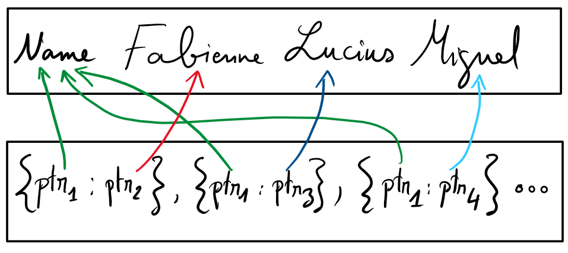

agnes
===
Simple JSON parser with a custom hashtable for string interning to be used in C/C++ applications.

# How to Use?
1. Put the three headers "common.h", "interner.h", and "parser.h" somewhere in your codebase.
2. Define `AG_PARSER_IMPLEMENT` in exactly one place, then include "parser.h" after that definition.
3. Initialise an `agnes_parser_t` structure correctly (see below).
4. Call `parse_json` with a pointer to the aforementioned struct.
5. Examine the return value.

## `agnes_parser_t`
```C
typedef struct agnes_parser {
    char const *filename; // useful for debugging
    u8 const *bytes; 
    size_t file_size;

    token_t *tokens;
    size_t max_tokens;

    size_t *line_info;

    allocator_t string_allocator;
} agnes_parser_t;
```
You **must** allocate the following buffers:
1. `u8 *bytes`: refers to the raw bytes to be parsed as json, could come from a file, or a conventional string. If you want to parse a file, you must read it yourself, put its conent in such a buffer. `file_size` is the size of this buffer in bytes.
2. `token_t *tokens`: this is used by the parser to store tokens. `max_token` refers to the maximum number of tokens this buffer accepts.
3. `size_t *line_info`: this is used by the parser to store line information for debugging. Its size must be at least `max_tokens * 8` bytes.

For `string_allocator`, you must pass two function pointers `alloc` and `free` which the string interner uses to store its data.
These can be as simple as wrappers around `malloc` and friends, or something more sophisticated. The only requirement is that `alloc` must return `true (1)` when succeeding.

## `example-include-as-header`
For a better understanding of the usage, read the contents of `include_as_head.c` (it is short).
You can build and run it using `run.py`.

# The String Interner
### Motivation for Interning
At the risk of stating the obvious, the interner's job is to eliminate redundancy in the data while stored in RAM.
The simplest example is this (which I presume is common enough):
```json
[
    {  
        "Name": "Fabienne",
        "DateOfBirth": "2001-08-25",
        "Description": "Persona non grata"
    },
    {  
        "Name": "Lucius Domitius Aurelianus",
        "DateOfBirth": "214-09-09",
        "Description": "Restitutor Orbis"
    },
    {
        "Name": "Miguel Angel Asturias",
        "DateOfBirth": "1899-10-19",
        "Description": "Poet-diplomat"
    }
]
```
If, while processing, we stored each string in the original file individually and treated them as unique, then we'd have N copies of "Name", of "DateOfBirth", and of "Description" in memory. Clearly, there is no need to store them seperately to parse or validate this data correctly.

The interner's job is to deduplicate such strings in the input data. Instead of storing the whole string again, a node referring to it gets a pointer an equivalent string stored earlier.

This is achieved via hashing which also means that parsing is computationally more intensive because each string encountered will go through a hashing cycle (which will trigger a byte-by-byte string comparison if the string is already stored or if two hashes collide).

However, I assert that, with conventional input data, the benefit of interning outweigh the cost of the extra steps taken for hashing. Furthermore, it makes manipulation of the data and comparison of strings easier.

This is how data would be representated in memory (slightly simplified):


The upper rectangle shows ultimately how strings are stored. The interner, using the allocation routines provided, reserves a linear chunk of memory and uses it like a stack. If it encounters a new string, it pushes it on top. If a string has already been encountered before, a pointer within that same stack is returned.
(In the picture, the stack top is to the right.)

## Motivation for Custom Hashing Scheme

### Small Problem:
Usually, one uses a hashtable to associate data with a given key. But in our case, we have no such data to associate. 
The table really only needs to store keys. If a string is in the table then it is there: that's all the information we need.
The problem with a generic hashtable implementation is that it will still expect values regardless of what we want: the easiest would be passing `true` to all entries.
Here again, we would be storing unnecessary data. There is no need for me to check the value of the entry to know that it's there and yet it occupies one extra byte.
For small files, this is fine. For bigger files, the calculus looks different.
Assume we are processing a 1 GiB file of which 8% are unique strings. That's 82 MiB just for strings. If the length of each string is 12 bytes on average, we'd have 7 million strings in memory and 7 MiB extra for useless boolean values.
This extra data isn't only burdensome to the user: it doesn't take much to miss a cache boundary, cause a page fault, or induce a syscall to allocate more memory.

### The Really Big Problem:
We already store our keys in memory we own for various uses, but a generic table will still allocate its own memory for all keys it stores. Suddenly, we have a doubling of the space required to store any number of strings. Going with the previous example, the table would be holding an extra 82 MiB. Professionals call this behaviour bad.

If we get clever and deallocate our own strings in favour of references to allocations owned by the table, we'd have to enforce the requirement that pointers to strings inside the table remain stable throughout the lifetime of the parser. This is somwehere between hard and arcane with a generic table made by someone else.


Therefore it is much easier to implement a minimal hashtable that only really fulfills these necessaties and doesn't store extra data. That's what "interner.h" is there for.